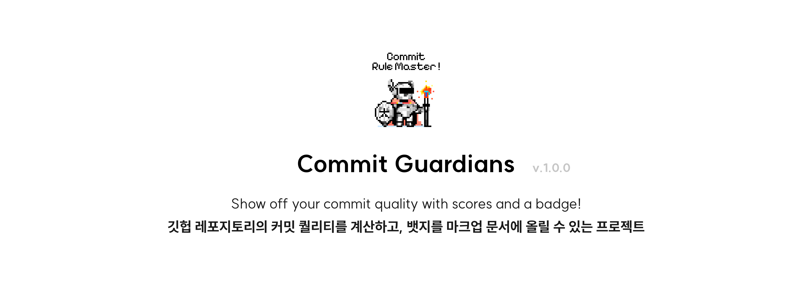
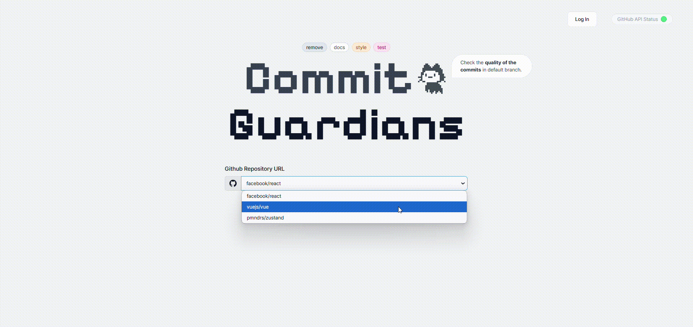
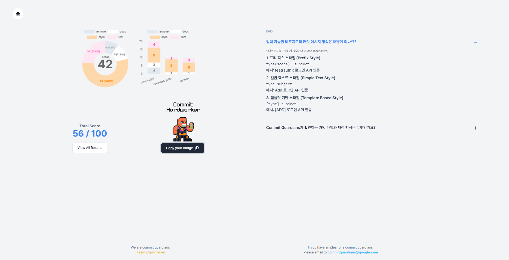
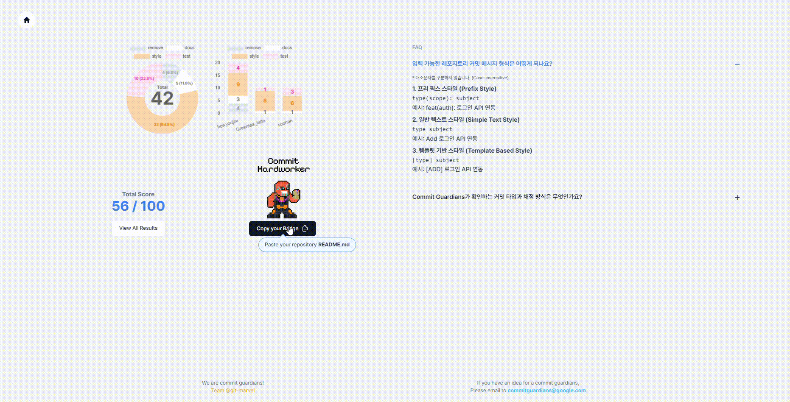
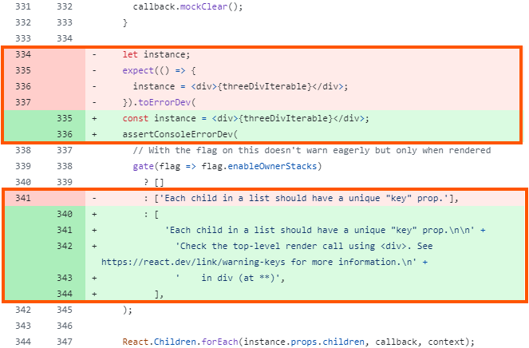
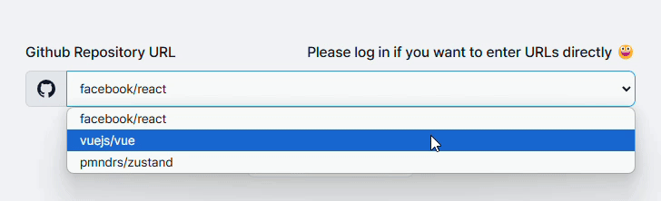
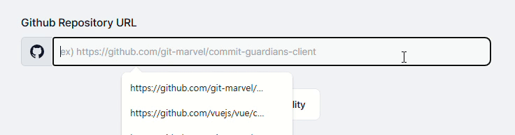
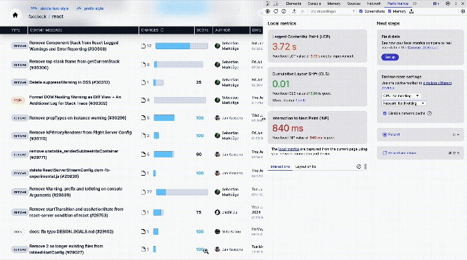

# Commit Guardians

## 프로젝트 소개



<br>

## 목차

- [프로젝트 등장 배경](#%ED%94%84%EB%A1%9C%EC%A0%9D%ED%8A%B8-%EB%93%B1%EC%9E%A5-%EB%B0%B0%EA%B2%BD)
- [기능](#%EA%B8%B0%EB%8A%A5)
  - [1. 메인 페이지](#1-%EB%A9%94%EC%9D%B8-%ED%8E%98%EC%9D%B4%EC%A7%80)
  - [2. 커밋 뱃지 페이지](#2-%EC%BB%A4%EB%B0%8B-%EB%B1%83%EC%A7%80-%ED%8E%98%EC%9D%B4%EC%A7%80)
  - [3. 커밋 분석 결과 페이지](#3-%EC%BB%A4%EB%B0%8B-%EB%B6%84%EC%84%9D-%EA%B2%B0%EA%B3%BC-%ED%8E%98%EC%9D%B4%EC%A7%80)
- [기술 스택](#%EA%B8%B0%EC%88%A0-%EC%8A%A4%ED%83%9D)
- [🤔 고민하고 결정한 부분](#1-%EB%8D%B0%EC%9D%B4%ED%84%B0-%ED%9A%A8%EC%9C%A8%EC%84%B1-vs-%EC%82%AC%EC%9A%A9%EC%9E%90-%EA%B2%BD%ED%97%98-rest-api-%EC%84%A0%ED%83%9D)
  - [1. 데이터 효율성 vs 사용자 경험: REST API 선택](#1-%EB%8D%B0%EC%9D%B4%ED%84%B0-%ED%9A%A8%EC%9C%A8%EC%84%B1-vs-%EC%82%AC%EC%9A%A9%EC%9E%90-%EA%B2%BD%ED%97%98-rest-api-%EC%84%A0%ED%83%9D)
  - [2. GitHub API Rate Limit 회피를 위한 토큰 로테이션 구현](#2-github-api-rate-limit-%ED%9A%8C%ED%94%BC%EB%A5%BC-%EC%9C%84%ED%95%9C-%ED%86%A0%ED%81%B0-%EB%A1%9C%ED%85%8C%EC%9D%B4%EC%85%98-%EA%B5%AC%ED%98%84)
  - [3. 깃허브 로그인 기능의 필수 도입과 비로그인 사용자 접근성 향상](#3-%EA%B9%83%ED%97%88%EB%B8%8C-%EB%A1%9C%EA%B7%B8%EC%9D%B8-%EA%B8%B0%EB%8A%A5%EC%9D%98-%ED%95%84%EC%88%98-%EB%8F%84%EC%9E%85%EA%B3%BC-%EB%B9%84%EB%A1%9C%EA%B7%B8%EC%9D%B8-%EC%82%AC%EC%9A%A9%EC%9E%90-%EC%A0%91%EA%B7%BC%EC%84%B1-%ED%96%A5%EC%83%81)
  - [4. 대용량 데이터를 저장하고 처리: indexedDB 사용](#4-%EB%8C%80%EC%9A%A9%EB%9F%89-%EB%8D%B0%EC%9D%B4%ED%84%B0%EB%A5%BC-%EC%A0%80%EC%9E%A5%ED%95%98%EA%B3%A0-%EC%B2%98%EB%A6%AC-indexeddb-%EC%82%AC%EC%9A%A9)
  - [5. 많은 컴포넌트들을 화면에 렌더링하기 위한 virtual scroll 도입](#5-%EB%A7%8E%EC%9D%80-%EC%BB%B4%ED%8F%AC%EB%84%8C%ED%8A%B8%EB%93%A4%EC%9D%84-%ED%99%94%EB%A9%B4%EC%97%90-%EB%A0%8C%EB%8D%94%EB%A7%81%ED%95%98%EA%B8%B0-%EC%9C%84%ED%95%9C-virtual-scroll-%EB%8F%84%EC%9E%85)
  - [6. 커밋 분석을 위한 커밋 타입 기획](#6-%EC%BB%A4%EB%B0%8B-%EB%B6%84%EC%84%9D%EC%9D%84-%EC%9C%84%ED%95%9C-%EC%BB%A4%EB%B0%8B-%ED%83%80%EC%9E%85-%EA%B8%B0%ED%9A%8D)
- [협업](#%ED%98%91%EC%97%85)
  - [1. 깃 커밋 컨벤션](#1-%EA%B9%83-%EC%BB%A4%EB%B0%8B-%EC%BB%A8%EB%B2%A4%EC%85%98)
- [팀원 소개](#%ED%8C%80%EC%9B%90-%EC%86%8C%EA%B0%9C)

<br>

## [프로젝트 등장 배경](#목차)

**현재 깃헙 레포지토리의 커밋들은 과연 건강한 상태일까요?**

이 질문에서 시작된 Commit Guardians 팀 프로젝트는, **커밋 메시지와 코드 변경 간의 일치성을 점검하고, 보다 나은 커밋 문화를 형성하기 위해 등장**하게 되었습니다.

개발자의 일상은 코드만 작성하는 것이 아닌 **‘기록’을 남기고 공유하는 과정까지도 포함**된다고 생각합니다. 특히 팀 프로젝트나 개인 프로젝트 뿐만 아니라 오픈소스에서도 **커밋 메시지**는 작업 흐름을 이해하고 지난 작업을 되돌아보며 프로젝트의 맥락을 파악하는 데에 중요한 역할을 하고 있습니다.

커밋메시지는 코드가 어떻게 변경되었는지 요약해 줄 뿐만 아니라, ‘왜’ 변경되었는지를 설명합니다. 그래서 코드 리뷰나 디버깅을 할 때 코드의 변경 사항을 빠르게 파악할 수 있는 중요한 역할을 하고 있습니다. 각 커밋 타입에 따라 릴리즈 노트를 자동으로 생성할 수도 있어서 작업 단위를 잘게 쪼개어 커밋을 하는 것은 협업에 있어서 좋은 습관이라고 생각합니다. 그렇기에 **커밋 메시지에 따른 코드 수정이 서로 일치해야** 합니다.

일반적으로 좋은 커밋 메시지의 내용은 **의미 있는 커밋 메시지를 쓰는 것**이며, 최대한 논리적인 단위로 변경 사항을 나누는 것입니다. 논리 단위별로 나누어 커밋을 하는 것이 개별 변경 사항으로 되돌리기 편하고 어느 부분에서 오류가 났는지 확인하기 수월하기 때문입니다. 이러한 꼼꼼한 커밋들이 모여서 유지보수가 용이하고 협업하기 좋은 프로젝트를 만드는 기초가 될 것으로 생각합니다.

<br>

## [기능](#목차)

### [1. 메인 페이지](#목차)

**1-1. 깃허브 로그인**

- 로그인 시 사용자가 원하는 레포지토리 URL 입력이 가능합니다.
- 로그인 전에는 예시 레포지토리로 서비스를 미리 이용해 볼 수 있습니다.

<p>
  
</p>

**1-2. 서비스 이용 가능 여부 확인하기**

- 헤더의 우측 상단 부분에는 Github API의 상태를 보여주고, 상태가 정상인 경우에만 URL 입력(커밋 분석)이 가능합니다.
- <a href="https://www.githubstatus.com/" target="_blank">Github API status 버튼</a> 선택 시 상세 내역을 볼 수 있습니다.

**1-3. 현재 대응 가능한 커밋 타입 확인하기**

- `remove` `docs` `style` `test`
- 로고 상단에는 이 프로젝트에서 분석하고 있는 4개의 커밋 타입을 알 수 있습니다.

**1-4. 커밋 분석 시작하기**

- 맨 처음 보이는 화면으로 사용자가 커밋을 분석 받고 싶은 깃허브 레포지토리의 URL을 입력할 수 있습니다.
- URL 입력하여 제출하면 기본 브렌치의 커밋 분석을 시작할 수 있습니다.

<br>

### [2. 커밋 뱃지 페이지](#목차)



메인 페이지에서 커밋 퀄리티 분석이 끝난 후 보여지는 페이지입니다.

**2-1. 점수에 따른 뱃지 차별화**

- 사용자의 점수에 따라 각각 다른 뱃지가 주어지며 4개의 뱃지로 구성되어 있습니다.
  점수 구간은 80점 이상, 50점 이상, 30점 이상, 30점 미만으로 채점됩니다.
- `Copy your Badge` 버튼을 통해 사용자의 레포지토리 README 에 뱃지를 붙여 넣기 할 수 있는 HTML 태그를 복사할 수 있습니다.

  

**2-2. 커밋 통계 그래프**

- 도넛 그래프
  - 중앙엔 검사한 커밋의 총 개수를 볼 수 있습니다.
  - 검사한 커밋들을 커밋 타입별로 분류하여 비율을 나타냈습니다.
- 막대 그래프
  - 가장 많이 기여한 상위 3명을 선정하여 각자의 커밋을 커밋 타입별로 분류해 나타냈습니다.

**2-3. 커밋 퀄리티 최종 점수**

- 100점 만점을 기준으로 사용자의 점수를 볼 수 있습니다.
- `View All Results` 버튼을 통해 커밋 분석 결과 페이지로 이동할 수 있으며 각각의 커밋마다의 점수를 확인할 수 있습니다.

**2-4. FAQ**

- 메인 페이지에서 입력 가능한 레포지토리 커밋 메시지 형식을 알 수 있습니다.
- 이 프로젝트에서 확인하는 커밋 타입과 채점 방식을 확인할 수 있습니다.

**2-5. 사용자와의 소통을 위한 이메일주소와 깃허브 링크**

- 푸터에는 사용자가 아이디어를 제안할 수 있는 이메일 주소와 해당 프로젝트의 깃허브 레포지토리 링크가 있습니다.

<br>

### [3. 커밋 분석 결과 페이지](#목차)


커밋 퀄리티를 분석한 각 커밋에 대한 상세 정보를 알 수 있습니다.

- 깃허브 소유자와 레포지토리 이름

- 커밋 메시지 형식별로 분류된 비율

  1.  Prefix Style
  2.  Simple Text
  3.  Template Based Style

- 각 커밋의 정보
  - COMMIT MESSAGE : 선택 시 해당 커밋의 깃허브 레포지토리 페이지가 열립니다.
  - CHANGES : 변경된 파일 개수뿐만 아니라, -/+ 의 묶음을 Change 로 정의하여 막대그래프를 통해 일치율을 확인할 수 있습니다.
    - Change 단위 예시
      <p>- change 2개</p>
        
  - DATE : 로컬날짜와 시간을 기준으로 확인할 수 있습니다.
  - SHA : 전체 SHA 값을 복사하거나 7자리만 복사할 수 있습니다.

<br>

## [기술 스택](#목차)

### 메인 라이브러리


  

 

### 기타 라이브러리

- `diff-match-patch` : 구글의 Neil Fraser가 개발한 오픈소스 라이브러리로, 텍스트의 차이점(diffs)을 계산하고 패치를 생성 및 적용하는 기능을 제공합니다. 대량의 커밋을 정확하고 빠르게 분석하여 코드 변경 사항을 확인하는 데 사용하였습니다.

- `idb-keyval` : IndexedDB를 간편하게 사용할 수 있게 해주는 경량 오픈소스 라이브러리로, key-value 형식의 데이터 저장 및 조회 기능을 제공합니다. zustand 상태 관리 라이브러리와 함께 사용하여 상태를 브라우저의 IndexedDB에 저장할 수 있어 대량의 상태 데이터를 효율적으로 처리하고, 사용자 경험을 향상할 수 있었습니다.

<br>

## [🤔 고민하고 결정한 부분](#목차)

### [1. 데이터 효율성 vs 사용자 경험: REST API 선택](#목차)

1️⃣ **Problem**

REST API를 이용하여 요청할 경우, 엔드포인트마다 전달받는 데이터 형식이 고정되어 있어 불필요한 정보도 함께 전달됩니다. 이에 따라 네트워크, 메모리, 프로세서 등의 리소스가 낭비됩니다. 실제로, [facebook/react](https://github.com/facebook/react)와 같은 대규모 프로젝트의 레포지토리를 분석할 경우 대략 1,500번의 요청을 보내고 응답을 받아 2만 개 정도의 커밋을 검사하게 되는데, 최소 5~10초 정도의 로딩 시간의 발생과 렉을 체감할 수 있었습니다.

2️⃣ **Action**

깃허브는 사용자의 요청을 더욱 유연하게 처리할 수 있도록 GraphQL이라는 데이터 쿼리 언어를 사용한 API를 제공하고 있습니다. 필요한 정보만 스키마에 명시하여 요청할 수 있기 때문에, 사용자는 대역폭과 메모리를 절약할 수 있습니다.

하지만 GraphQL은 사용할 때 두 가지 주요 차이점이 존재했습니다.

1. 토큰 기반 페이지네이션 (Token-Based Pagination)

   GraphQL은 페이지네이션을 지원하지만, 페이지 번호 기반이 아닌 토큰 기반을 사용합니다. 이에 따라 순차적으로 다음 페이지의 내용을 요청해야 했고, REST API처럼 비동기적으로 커밋 목록을 병렬로 요청할 수 없어 페이지 로딩 시간이 많이 증가했습니다.

2. 커밋 변경 사항 미제공

   GraphQL은 커밋의 변경 사항 제공하지 않았습니다.

3️⃣ **Result**

데이터를 쿼리언어인 GraphQL로 전환하여 리소스의 사용을 최적화하려 했었지만, 유저 사용성을 위해 기존 REST API로 요청하던 방식을 유지하기로 했습니다.

<br>

### [2. GitHub API Rate Limit 회피를 위한 토큰 로테이션 구현](#목차)

<a href="https://docs.github.com/en/rest/using-the-rest-api/rate-limits-for-the-rest-api?apiVersion=2022-11-28#primary-rate-limit-for-authenticated-users" target="_blank">Github API Rate Limit 참고 링크</a>

1️⃣ **Problem**

**Github API 호출 인증된 토큰 시간당 5,000회 제한**

Github API 에 의존도가 높은 프로젝트였기에 **Github API 요청 제한 수는 저희 프로젝트에서 치명적**이었습니다. 커밋 분석 로직은 API 호출을 통해 필요한 값들을 불러오고, 커밋 메시지의 커밋 타입을 분석한 이후, 검사 가능한 커밋 타입들만을 필터링합니다. 필터링한 커밋의 `owner`, `repo`, `sha` 를 기반으로 API 호출을 통해 코드의 수정 정보인 diff 데이터를 가져옵니다.

특히나 한 인증된 토큰 시간당 5,000회가 최대였기 때문에 예를 들어, <a href="https://github.com/facebook/react" target="_blank">facebook/react</a> 와 같이 커밋 갯수가 19,000개 이상의 경우 19,000/100 = **190**회 API 호출을 통해 전체 커밋의 정보를 가져오고, 검사 가능한 커밋을 추출하면 (2024.12.25 일 기준으로) 1450 개이므로, **1,450**회의 diff API 호출을 더 하게 됩니다.

즉, facebook/react 는 190 + 1,450 = **1,640**회의 API 호출을 하게 됩니다. 그럼 사실 2, 3번의 facebook/react 정도의 레포지토리만 조회하더라도 GitHub API Rate Limit를 모두 소진하게 되는 문제가 있었습니다.

또한, 검사 가능한 커밋 타입이 추가가 된다면 더 많은 API 호출을 예상할 수 있습니다. 만약 모든 커밋이 검사 대상이라면 커밋 개수의 101%만큼 API 호출을 하게 됩니다.

**인증된 토큰 로테이션 방식 검토**

GitHub API 요청 제한은 토큰마다 독립적으로 적용되고 있습니다. API 호출이 많은 작업에서 Rate Limit를 초과하는 문제가 빈번하게 발생했고, 하나의 토큰만으로는 프로젝트 요구 사항을 충족할 수 없었습니다. 여러 Personal Access Token(PAT)을 환경 변수로 받아 이를 효율적으로 로테이션하는 방식을 차 우선으로 검토했습니다.

2️⃣ **Action**

**토큰 로테이션 로직 구현하여 일시적으로 해결했습니다**. 여러 토큰을 `tokenStates`이라는 배열로 관리하며, 각 토큰의 남은 호출 가능 횟수(remaining)를 추적하도록 설계했습니다. API 호출 시, 남은 요청량이 가장 많은 토큰을 선택해 Rate Limit 초과를 방지했습니다. 호출 후, GitHub API의 응답 헤더에서 반환되는 `X-RateLimit-Remaining` 값을 사용해 토큰 상태를 업데이트했습니다. `getBestGithubToken()` 현재 사용 가능한 토큰 중 가장 많은 남은 요청 횟수를 가진 토큰을 반환하도록 했습니다. `updateTokenState()` 호출 후, 사용한 토큰의 상태를 최신 상태로 업데이트하여 토큰을 들고 올 때 남은 호출 가능 횟수를 가져올 수 있도록 합니다.

```js
const GITHUB_REQUEST_LIMIT = 5000;

const tokenStates = [
  {
    token: import.meta.env.VITE_GITHUB_TOKEN,
    remaining: GITHUB_REQUEST_LIMIT,
  },
  ...
];

const getBestGithubToken = () => {
  tokenStates.sort((a, b) => b.remaining - a.remaining);

  return tokenStates[0].token;
};

const updateTokenState = (token, remaining) => {
  const tokenState = tokenStates.find((t) => t.token === token);

  if (tokenState) {
    tokenState.remaining = remaining;
  }
};

export { getBestGithubToken, updateTokenState };
```

3️⃣ **Result**

여러 토큰을 활용한 로테이션 방식으로, 대규모 데이터를 안정적으로 처리할 수 있었습니다. 그래서 facebook/react처럼 커밋이 많은 레포지토리에서도 분석이 중단되지 않고 완료될 수 있었습니다. 토큰이 추가될 경우 `tokenStates` 배열에만 추가하면 자동으로 적용되도록 설계했습니다.

<br>

### [3. 깃허브 로그인 기능의 필수 도입과 비로그인 사용자 접근성 향상](#목차)

1️⃣ **Problem**

검사할 커밋이 단일 토큰의 요청량인 5,000개 이상의 레포지토리도 정상적으로 모두 검사할 수 있도록 토큰 로테이션 방식을 구현하였습니다. 배포하지 않고 로컬에서만 운영한다면 토큰 로테이션 방식으로도 문제가 없겠지만, 배포하여 서비스한다면 많은 사람들이 이용하는 API 사용량이 저희가 수동으로 추가한 토큰의 요청량을 감당할 수 없을 것입니다.

유저의 접근성을 위해 로그인 기능을 추가하지 않으려 했지만, 배포된 서비스가 정상적으로 돌아가려면 각 유저의 토큰을 사용하는 것이 최선이고 결국 로그인은 필수 불가결이 되었습니다. 하지만 로그인하지 않고 서비스를 경험하는 것도 중요하다 생각하여 방법을 찾게 되었습니다.

2️⃣ **Action**

**- 데모 버전 제공 고려**

처음에는 로그인하지 않은 사용자가 링크를 제출하면 기본 토큰의 요청량(시간당 60개)을 이용하여 일부만 보여주도록 하고 로그인을 유도하려 했습니다. 하지만 정말 일부의 커밋 분석만 보여줄 수 있고 통계 기능을 사용할 수 없으며, 토큰의 요청량을 빠르게 소진하기 때문에 다른 레포지토리를 분석할 수 없다는 문제가 있었습니다. 또한, 일부 경우에는 API에 접근 자체가 되지 않는 문제도 발생했습니다.

**- 목업 데이터를 이용한 동일한 경험 제공**

따라서 일부 유명한 레포지토리의 데이터를 가져와 목업 데이터로 제공하기로 했습니다. 또한 사용자가 로그인한 유저와 최대한 비슷한 체험을 하기 위해 기능과 인터페이스적 요소를 똑같이 이용하게 하는 것이 중요하다고 생각했습니다.

3️⃣ **Result**

비로그인 상태에서는 텍스트 입력 박스를 선택 박스로 변경하고, 제공되는 선택지를 이용해 제출하게 되면 목업 데이터를 이용해 실제 기능과 동일한 경험을 할 수 있게 하였습니다. 또한, 문구를 박스 위에 두어 로그인 시 직접 입력할 수 있는 점을 알게 하였습니다.





프로세스가 거의 똑같기 때문에 사용자가 로그인하지 않고 체험하면서 튜토리얼의 기능도 가질 수 있게 되었습니다.

<br>

### [4. 대용량 데이터를 저장하고 처리: indexedDB 사용](#목차)

1️⃣ **Problem**

**- 대용량 데이터 처리 시 에러 발생**

커밋에 대한 데이터 관리로 페이지 리로드 시 상태가 초기화되는 것을 방지하기 위해 sessionStorage에 저장했습니다.

GitHub API를 통해 커밋들의 변경 내용(diff)을 가져오는 과정에서 코드의 변경 사항이 많을 경우 저장되는 데이터의 크기가 매우 커졌고 이에 따라 데이터 저장에 문제가 발생하게 되었습니다.

sessionStorage는 대용량의 데이터를 처리할 경우 데이터가 저장되지 않고 용량이 초과하였다는 에러가 발생하는 문제가 있었습니다.

sessionStorage는 브라우저마다 약 5MiB의 용량 제한이 있었고 이 용량 이상의 데이터를 저장하기에는 적합하지 않았습니다. GitHub API로 응답받는 커밋 diff 데이터는 변경된 코드양에 따라 매우 큰 크기의 데이터가 될 수 있기 때문에 기존의 sessionStorage로는 데이터 저장 실패로 인한 에러 발생 가능성이 커졌습니다.

2️⃣ **Action**

이 문제의 해결을 위해 sessionStorage대신 IndexedDB를 사용했습니다.

- IndexedDB
  브라우저 내에서 대규모 데이터 구조를 저장하고 고성능 검색을 위해 인덱싱하는 웹 API입니다.

idb-keyval 라이브러리를 통해 간단한 API(`get()`, `set()`, `del()` 등)을 써서 IndexedDB를 다룰 수 있도록 구현했습니다. 또한 zustand를 통해 상태를 관리하면서 데이터를 IndexedDB에 저장하는 방식으로 전환했습니다.

- zustand의 persist 미들웨어(`storage: createJSONStorage(() => indexedDB)`)를 활용하여 zustand 상태를 IndexedDB에 저장하도록 설정했습니다.
- IndexedDB에서 데이터를 불러오거나 삭제할 때 발생할 수 있는 에러를 처리해 주는 부분을 추가했습니다.

```jsx
import { create } from "zustand";
import { createJSONStorage, persist } from "zustand/middleware";
import { get, set, del } from "idb-keyval";
import { throwIndexedDBErrorMessage } from "../../../shared/error/throwCustomErrorMessage";

const indexedDB = {
  getItem: async (name) => {
    try {
      const value = await get(name);
      return value || null;
    } catch (error) {
      throwIndexedDBErrorMessage(error);
    }
  },
  setItem: async (name, value) => {
    try {
      await set(name, value);
    } catch (error) {
      throwIndexedDBErrorMessage(error);
    }
  },
  removeItem: async (name) => {
    try {
      await del(name);
    } catch (error) {
      throwIndexedDBErrorMessage(error);
    }
  },
};

const initialState = {};

const useCommitStore = create(
  persist(
    (set) => ({
      ...initialState,
    }),
    {
      name: "commit-storage",
      storage: createJSONStorage(() => indexedDB),
    }
  )
);

export default useCommitStore;
```

3️⃣ **Result**

**- sessionStorage에서 발생하던 저장 용량 초과 문제를 해결**

IndexedDB는 5MiB보다 훨씬 큰 용량(GB 단위)을 지원하여 커밋 diff 데이터와 같은 대량의 데이터를 처리할 때 에러가 발생하지 않고 원활하게 저장할 수 있게 되었습니다.

zustand와 결합하여 커밋 관련 상태를 지속적으로 관리할 수 있게 되었고 idb-keyval 라이브러리를 통해 코드 복잡도를 줄이고 대용량 데이터를 안정적으로 처리할 수 있게 되었습니다.

<br>

### [5. 많은 컴포넌트들을 화면에 렌더링하기 위한 virtual scroll 도입](#목차)

<a href="https://github.com/git-marvel/commit-guardians-client/pull/93" target="_blank">virtual scroll 도입한 PR 링크</a>



1️⃣ **Problem**

**- INP 지수 상승 및 화면 버벅임**

이미 검사가 끝난 모든 커밋들의 데이터를 가지고 컴포넌트를 렌더링하는 디테일 뷰에는 **화면 성능에 관한 문제**가 있었습니다. 적은 양의 컴포넌트들을 스크롤 할 때는 큰 문제가 없었지만, 많은 양의 컴포넌트들을 (대략 1천 개 이상의 커밋 컴포넌트) 가진 디테일 화면에 첫 진입 시 화면 렌더링의 시간이 지연되었습니다. 브라우저 퍼포먼스 탭을 확인해 보니 <a href="https://web.dev/articles/inp?hl=ko">**INP**</a>(**Interaction to Next Paint**) 지수가 급격히 상승하고, 화면이 동적으로 변할 때, 특히나 버벅이는 문제가 있었습니다. 이 문제는 사용자는 화면 전환 시의 느린 반응 속도와 지연으로 인해 답답함을 느끼게 하고, 전체적인 사용자 경험을 저하하고, 앱 성능에 대한 부정적인 영향을 끼칠 것으로 예상했습니다.

브라우저가 모든 컴포넌트를 한 번에 렌더링하려는 과정에서 브라우저가 필요하지 않은 데이터까지 모두 DOM에 렌더링하는 방식이 병목현상의 주요 원인임을 확인할 수 있었습니다. 스크롤이 필요한 디테일 화면에서 스크롤 사용 시 성능 저하가 더욱 심각하게 나타나는 것을 확인했습니다. 따라서 INP 지수를 개선하고, 스크롤 시 부드러운 사용자 경험을 제공할 방법을 찾아야 했습니다.

2️⃣ **Action**

**- Virtual Scroll 도입**

이 문제를 해결하기 위해 저희는 **Virtual Scroll** 기술을 도입하였습니다. Virtual Scroll 은 사용자가 **현재 화면에서 보고 있는 부분에 해당하는 데이터만 DOM에 렌더링하고, 보이지 않는 부분은 렌더링하지 않음**으로써 브라우저의 불필요한 작업을 줄여주는 기술입니다. 이런 방식을 통해 초기 렌더링 시 필요하지 않은 데이터 처리를 최소화하고, 렌더링 속도를 크게 향상할 수 있었습니다. 더불어 무한 스크롤처럼 페이지네이션을 통한 데이터 요청을 통해서도 개선할 수 있었지만, 이미 커밋들이 분석된 다음 디테일 화면 페이지를 보는 것이기에 무한 스크롤 기능은 필요 없다고 판단했습니다. Virtual Scroll을 도입하고 렌더링 최적화를 위해 컴포넌트 분리 및 메모이제이션 적용하여 성능을 개선했습니다.

3️⃣ **Result**


초기 렌더링 시 불필요한 DOM 작업을 줄이고, 스크린에 보여주는 부분만 DOM에 그리도록 하면서 INP 지수를 개선할 수 있었습니다. 이로써, 두 가지 이점을 더 얻을 수 있었습니다.

1. **스크롤 성능 향상**: 대규모 커밋 데이터를 가진 화면에서도 스크롤이 부드럽게 작동하고 즉각적인 반응성 제공할 수 있게 되었습니다.
2. **사용자 경험 개선**: 화면 전환 속도가 빨라지고, 데이터가 많은 화면에서도 높은 성능 유지할 수 있습니다.

결과적으로, 대규모 커밋 데이터를 다루는 레포지토리 결과를 볼 때에도 안정적인 성능과 원활한 사용자 경험을 달성하게 되었습니다.

<br>

### [6. 커밋 분석을 위한 커밋 타입 기획](#목차)

좋은 커밋인지를 판단하기 위해 커밋의 메시지와 실제 변경 내용의 맥락이 일치하는지 검사가 필요했습니다. 예를 들어 커밋 메시지에 “test: 테스트 코드 수정”이라고 적혀있으나 변경 내용엔 해당 내용과 관련 없는 부분이 포함되는 경우에는 커밋의 질을 낮춘다고 판단되어야 합니다.

1️⃣ **Problem**

1. 커밋 메시지 형식의 비일관성

   커밋 메시지에 대한 컨벤션이 존재하지만, 프로젝트마다 다른 규칙을 적용하거나 컨벤션을 강제하지 않은 경우가 많았고 동일한 커밋 타입이어도 작성자의 스타일에 따라 메시지 형식이 달랐습니다.

2. 커밋 메시지와 코드 변경 내용 간의 모호한 기준

   예를 들어, 커밋 메시지 타입이 `fix`이고 CSS 관련 UI 변경이 된 경우에는 `fix`인지 `design`인지 판단하는 기준이 모호했습니다. `refactor`, `feat` 등의 경우에도 해당 커밋의 코드 변경 내용만을 보고 정형화된 규칙만으로 일치성을 판단하기에는 어려웠습니다.

3. 동일한 타입이지만 다양한 해석

   같은 단어이지만 다양한 의미로 사용하는 경우가 빈번했습니다. 커밋 메시지 타입이 `style`일 때 코드 포맷 변경을 나타내는 경우도 있지만 디자인적인 스타일 변경에 사용되기도 했으며 `chore`인 경우에도 빌드에 관련 수정만을 나타내는 의미로 쓰이거나 자잘한 수정의 의미까지 포함하여 사용하는 경우도 있었습니다.

<br>

2️⃣ **Action**

**1. 작성자의 스타일에 따른 커밋 메시지 형식 분석**

커밋 메시지를 세 가지 주요 형식으로 분류했습니다. 다양한 형식의 커밋 메시지가 입력되더라도 지정된 형식을 따를 경우 커밋 퀄리티를 분석할 수 있도록 했습니다.

- 입력할 수 있는 커밋 메시지 형식 지정

  대소문자 구분이 없습니다. (Case-insensitive)

  1.  프리 픽스 스타일 (Prefix Style)

      `type(scope): subject`

      예시: feat(auth): 로그인 API 연동

  2.  일반 텍스트 스타일 (Simple Text Style)

      `type subject`

      예시: Add 로그인 API 연동

  3.  템플릿 기반 스타일 (Template Based Style)

      `[type] subject`

      예시: [ADD] 로그인 API 연동

<br>

**2. 모호한 커밋 타입의 문제해결을 위한 필터링**

| 커밋 내용[카테고리]                                            | 타입                                                                                | 추적/분석 요인                             |
| -------------------------------------------------------------- | ----------------------------------------------------------------------------------- | ------------------------------------------ |
| 1. 기능을 추가                                                 | feat, make, implement                                                               |                                            |
| 2. 파일을 삭제                                                 | remove, removed, removes, delete, deletes, deleted, erase, erases, erased, discard, |                                            |
| 3. 문서 작업만                                                 | docs, doc, documentation, readme                                                    | 파일 확장자명 (.md, .mdx, .docs, ...)      |
| 4. 버그 수정                                                   | fix, fixed                                                                          |                                            |
| 5. 리팩토링                                                    | refactor                                                                            |                                            |
| 6. 코드 포멧팅                                                 | style, format, beautify, "reformat”                                                 |                                            |
| 7. 디자인 스타일링만                                           | design, css                                                                         | 파일 확장자명 (.css, .scss) / tailwind (…) |
| 8. 테스트를 추가하거나 변경하는 코드                           | test, tests, verify, unittest                                                       | 파일확장자 및 상대경로 (.jest, ...)        |
| 9. 빌드 및 설정 파일 수정(프로젝트의 기능과 직접적으로 연관 x) | chore                                                                               |                                            |

<br>

`fix`, `feat`, `refactor`와 같은 커밋 타입은 코드 변경 내용을 기반으로 분석할 수 있는 경우도 있었지만, 대부분은 명확한 기준을 가지고 판단하기 어려운 경우가 많았습니다. 커밋 메시지의 내용뿐만 아니라 전체 코드의 내용도 파악이 되어야 커밋 메시지와 코드 변경 내용의 일치성을 알 수 있었기 때문에 하나의 커밋의 변경 내용(diff)으로는 좋은 커밋인지 알기 어려웠습니다.

따라서 분석 가능성이 높은 커밋 타입을 필터링하여 모호성을 최소화하고 일관된 평가를 가능하게 했습니다.

대부분의 오픈소스 프로젝트에서 의미가 명확히 구분되고 실제 코드의 변경 내용과 커밋 메시지 간의 일치성을 판단하는 기준을 세울 수 있다는 점에서 `style`, `remove`, `docs`, `test` 4가지 타입으로 분석 대상을 선택했습니다.

<br>

**3. 커밋 메시지 타입과 의미에 대한 명확한 기준 설정**

동일한 타입이지만 다양한 해석이 될 수 있는 문제를 개선하기 위해 4가지 타입이 실제로 어떤 의미로 쓰이고 그에 따른 코드 변경 사항은 어떻게 되는지 분석했습니다.

타입마다 공통된 코드 변경 사항을 찾고 일반적으로 자주 쓰이는 의미를 기반으로 명확한 기준을 설정했습니다. 예를 들어, `style` 타입은 HTML 태그에 언어 속성 추가, config파일 수정, 쓰이지 않은 코드를 삭제한 경우 등 판단 기준을 세우기 어려운 케이스보다는 일반적으로 쓰이는 코드 포맷에 관한 수정에 대해 분석하여 기준을 설정했습니다.

<br>

3️⃣ **Result**

현재는 변경 내용과 커밋 메시지를 판단할 때 명확한 대응이 가능한 타입만을 우선적으로 선택했으며 추후 필터링 기준을 확장하여 `feat`, `fix` 등을 포함하기 위한 추가 개선을 진행할 예정입니다.

**- 이 프로젝트에서 확인하는 커밋 타입과 기준**

- remove
  - 파일 및 폴더, 코드를 삭제한 커밋
    - 변경 사항에 삭제한 부분만 포함됐는지 확인합니다.
  - 해당하지 않는 경우 예시
    - 파일 삭제와 코드 수정을 같이 커밋했을 경우에 해당합니다.
    - 변경 사항에 코드의 추가된 부분이 포함된 경우에 해당합니다.
- docs
  - 문서 작업만을 한 커밋
    - 문서에 사용되는 파일만 포함됐는지 확인합니다.
      - 이미지 파일 - `.img`, `.png`, `.jpeg`, `.svg`, `.ai`
      - 기타 문서 파일 - `.pdf` ,`.docs`, `.md`, `.mdx`, `.rst`
  - 해당하지 않는 경우 예시
    - 문서 파일과 소스 코드 파일의 수정 사항을 같이 커밋했을 경우에 해당합니다.
- style
  - 주로 코드 포매팅, 들여쓰기, 코드 정렬 등 코드의 동작에 영향을 주지 않는 수정을 한 커밋
    - 파일명에 style을 나타내는 단어 확인 ("prettier", "eslint", "config”)
    - 변경 사항에 특수문자(`,` , `'` , `"` , `\n` , `;` 등)만 수정됐는지 확인합니다.
    - 변경 사항이 `console.log` 와 관련됐는지 확인합니다.
    - 요소들의 위치 변경 확인합니다.
      - Tailwind CSS className의 속성 순서를 확인합니다.
      - 객체 속성들의 순서를 확인합니다.
  - 해당하지 않는 경우 예시
    - 변수명 변경 등 style 체크 사항에 벗어난 경우에 해당합니다.
- test
  - 테스트를 추가하거나 변경한 커밋
    - 테스트 코드를 작성한 파일만 포함됐는지 확인합니다.
      - `test`, `tests`, `spec`, `mock`
  - 해당하지 않는 경우 예시
    - test 검증 키워드가 파일명에 없거나 끝에 위치하지 않은 경우에 해당합니다.
      - `a/src/compiler-worker.ts`
      - `a/mock_feed_repository_impl.dart`
    - 테스트 코드 관련 파일이 아닌 설정 파일 등의 수정 사항을 같이 커밋했을 경우에 해당합니다.

<br>

## [협업](#목차)

### [1. 깃 커밋 컨벤션](#목차)

| 제목     | 내용                                     |
| -------- | ---------------------------------------- |
| feat     | 새로운 기능에 대한 커밋                  |
| fix      | 버그 수정에 대한 커밋                    |
| chore    | 빌드 수정에 대한 커밋                    |
| docs     | 문서 수정에 대한 커밋                    |
| style    | 코드 스타일 혹은 포맷 등에 관한 커밋     |
| refactor | 코드 리팩토링에 대한 커밋                |
| design   | CSS 디자인에 대한 커밋                   |
| test     | 테스트 코드 추가, 삭제, 변경에 대한 커밋 |
| remove   | 불필요한 파일이나 로직 삭제에 관한 커밋  |

<br>

## [팀원 소개](#목차)

**신철환** (<a href="https://github.com/GreenteaHT" target="_blank">깃허브 주소</a>)

서비스의 목적을 가진 프로젝트의 협업은 이번이 처음입니다. 그전에는 팀원들과 같이 코딩하면서 협업이란 무엇인지에 대해 이론적으로 접근했지, 크게 와닿지는 않았습니다. 프로젝트를 진행하는 몇 주 동안 역할을 나누고, 많은 시간을 하나의 목표에 대해 집중하게 되면서 협업에 대해 많이 생각하게 되었습니다.

저희 프로젝트 주제로 커밋을 올바르게 사용하는 방법에 대해 조사하면서 단순히 커밋이 기록의 수단이 아니라 저희가 하는 협업의 ‘언어’라는 느낌을 많이 받았습니다. 가는 말이 고와야 오는 말이 곱다는 속담처럼 커밋도 잘 작성하고 전달해야 소통이 잘 진행되는 것 같았습니다.

그래서 저에게 협업을 잘했냐고 물으면 저는 이번에는 커밋을 잘 쓰지 못해서 아쉽다고 대답할 겁니다. 하지만 나중에는 멋진 커밋을 쓰고 당당하게 “네”라고 답할 겁니다.

**홍유진** (<a href="https://github.com/howyoujini" target="_blank">깃허브 주소</a>)

이번 프로젝트를 진행하면서 커밋이 단순한 기록이 아니라, 프로덕트의 기반을 이루는 중요한 요소라는 사실을 다시 한번 실감하게 되었습니다. 사실, 커밋의 중요성에 대한 이야기는 자주 들었었지만, 이 프로젝트를 경험하기 전까지는 깊이 공감하지 못했습니다. 이번 프로젝트 경험을 통해, 좋은 커밋이 동료 개발자의 생산성을 얼마나 크게 향상할 수 있는지를 체감하게 되었습니다.

또, 팀 프로젝트로 함께 협업하면서 서로의 생각을 맞춰나가는 과정이 즐거웠습니다. 지금은 저희 프로젝트가 `style`, `remove`, `test`, `docs`의 커밋타입만 가능하지만, 이후 하나씩 하나씩 더 추가하여 업데이트할 수 있었으면 좋겠습니다!

**김수한** (<a href="https://github.com/shkimjune" target="_blank">깃허브 주소</a>)

프로젝트 진행 초기에는 커밋메시지에 관한 기준을 정하는 과정이 있었습니다. 사람마다 다르게 작성된 커밋 메시지와 변경 내용의 일치성을 규격화된 기준을 정해 판단해야 했기 때문에 새로운 케이스가 나올 때마다 어떤 식으로 규격화를 시켜야 할지 고민을 많이 했던 것 같습니다. 또한 API로 응답받은 데이터 처리 관련해서 다양한 문제들을 마주하게 되었습니다. 이를 해결하는 과정에서 IndexedDB 활용과 많은 양의 데이터를 API 요청을 보낼 때 효율적으로 보낼 수 있는 방식 등 여러 가지를 배우게 되었습니다.

예상하지 못한 문제가 생겼을 때 팀원들과 각자의 의견을 공유하고 회의를 하다 보면 새로운 방향의 해결책들이 나와서 다양한 시도를 해볼 기회가 되었습니다. 짧은 기간이었지만 새로운 개념들을 배우게 되었고 효율적인 소통 방식에 대해 생각해 보고 적용해 볼 수 있었던 좋은 경험이었습니다.
